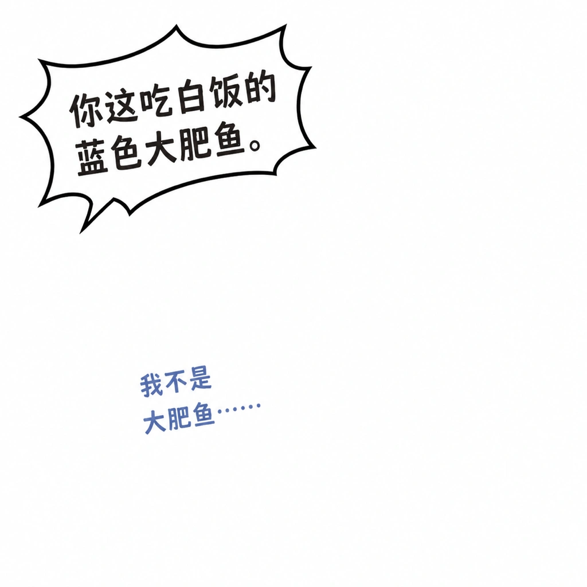

# Confrontation dialogue

- Use for accusation versus timid denial, off-panel pressure, or a sharp power imbalance.
- Put the loud off-panel line in a large jagged bubble; place Whale-chan's reply nearby as much smaller muted-blue text.
- Use dark charcoal handwritten lettering for the attack and thinner low-contrast blue lettering for the reply.
- Make the two text units visibly unequal in scale and confidence.
- Store both semantic lines in ordered `core_text`; an ellipsis may reinforce the weak reply.
- Do not draw the off-panel speaker unless the user explicitly requests a supporting character.

Prompt fragment: Build a confrontation through typography: one large jagged off-panel accusation bubble in bold dark hand lettering, opposed by a much smaller muted-blue unbubbled reply near Whale-chan. Preserve the power contrast but invent new wording and composition.
