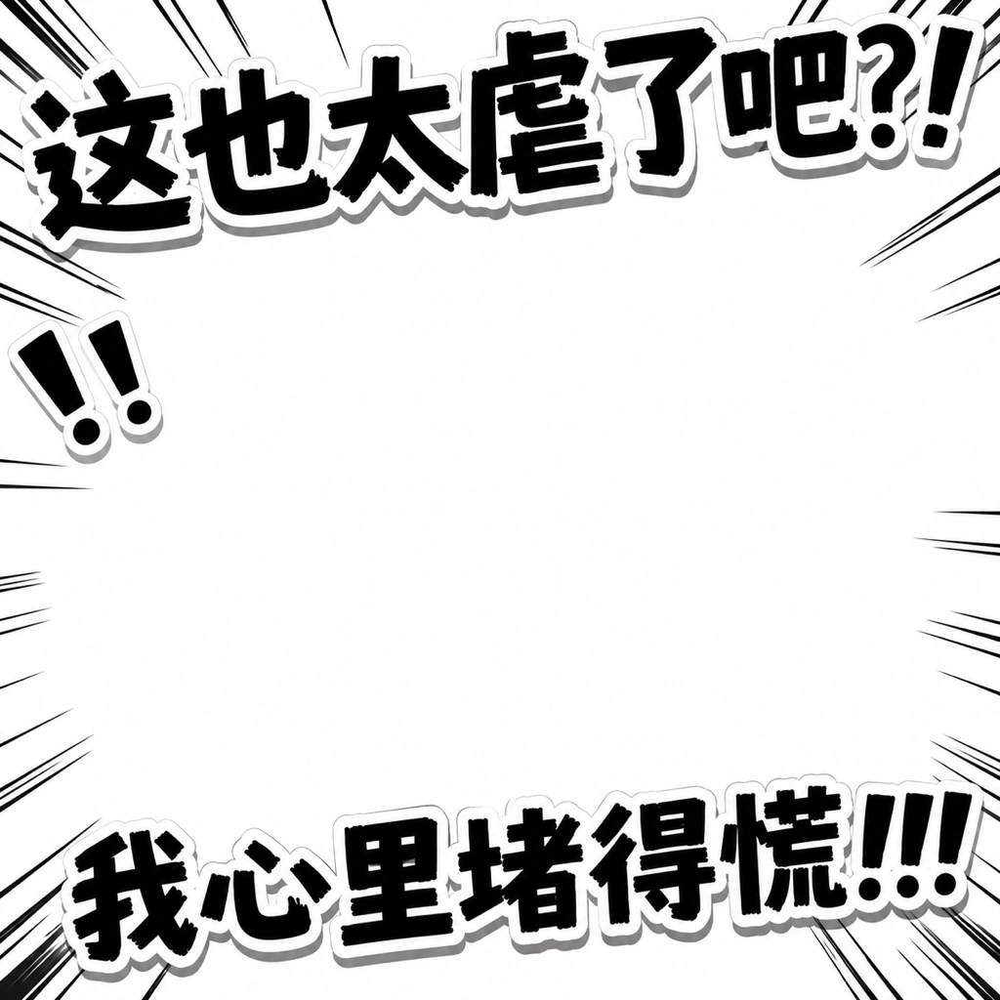

# Manga impact

- Use for extreme panic, disaster, black comedy, or an abstract breakdown.
- Place one headline across the top and another across the bottom, leaving the center for a close reaction.
- Use rough near-black brush lettering, uneven character scale and tilt, a thick white cutout outline, and a hard gray offset shadow.
- Add black speed lines from the edges and forceful punctuation; keep the center readable.
- Store both headline groups in ordered `core_text`; treat repeated punctuation and impact marks as `flavor_text` when not user-locked.
- Do not use for warm, subtle, or information-dense scenes.

Prompt fragment: Use black-and-white manga impact typography: rough near-black brush Chinese at the top and bottom, uneven scale and tilt, thick white cutout outline, hard gray shadow, and inward-radiating speed lines around an open central reaction zone. Never copy the sample wording.
